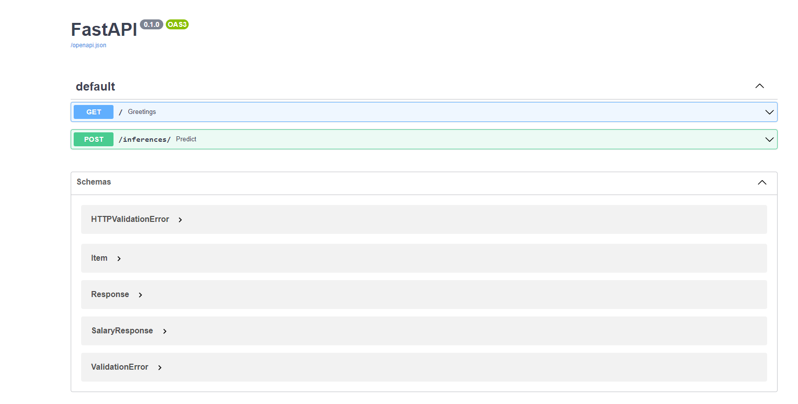
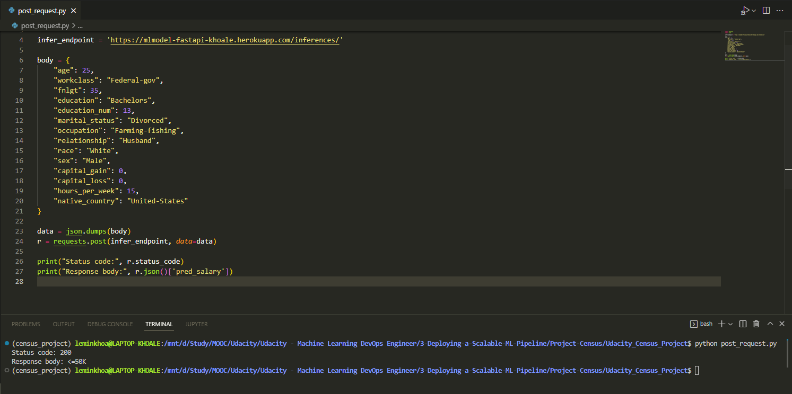

# 💡 Deploying a Machine Learning Model with Heroku and FastAPI
In this project, we will apply the skills to develop a classification model on publicly available Census Bureau data. We will create unit tests to monitor the model performance on various slices of the data. Then, we will deploy your model using the FastAPI package and create API tests. Both the slice-validation and the API tests will be incorporated into a CI/CD framework using GitHub Actions.


# 🏗️ Environment Set up
## Conda Environment
   - Download and install conda if you don’t have it already.
   - Use the supplied requirements file to create a new environment, or
   - To create a local conda environment for the project, run:
   ```
   conda create -n [envname] "python=3.10.7" scikit-learn dvc pandas pandas-profiling=3.2.0 numpy pytest jupyter jupyterlab fastapi uvicorn hydra-core -c conda-forge
   ```
   - To activate local environment, run `conda activate [envname]`
   - Install git either through conda (“conda install git”) or through your CLI, e.g. sudo apt-get git.

## Git/DVC
   - Set up the repository with Git and DVC by running:
   ```
   git init
   dvc init
   ```

## Remote Storage on S3
   - In CLI environment install the<a href="https://docs.aws.amazon.com/cli/latest/userguide/cli-chap-install.html" target="_blank"> AWS CLI tool</a>. 
   - Make sure you've already configured your AWS credentials in `.aws`
   - From the Services drop down select S3 and then click Create bucket.
   - Give your bucket a name, the rest of the options can remain at their default.
   - Create a remote DVC remote pointing to your S3 bucket and commit the data. 
   - To set remote directory in S3, use `dvc remote add s3_remote s3://<bucket_name>`
   - To commit the data, for example, run `dvc add data/census.csv` and `dvc commit data/census.csv`
   - Then, we can push by using `dvc push`, (this assumes `s3_remote` is a default remote)

## Heroku 
   - Create a Heroku account at `https://signup.heroku.com/`

# Repository Structure
```
├── Aptfile          # Store url to Heroku buildpack
├── Procfile         # Initial script for Heroku to start server
├── README.md                       
├── data             # Data used for project
│   ├── census.csv.dvc     # dvc config to pull raw data
│   └── census_updated.csv.dvc      # dvc config to pull cleaned data
├── dvc_on_heroku_instructions.md
├── eda              # Folder for EDA tasks
│   ├── eda_raw.ipynb      # EDA on raw data
│   └── eda_updated.ipynb  # EDA on cleaned data
├── main.py          # Script to run app
├── post_request.py  # Script to send POST request to Heroku server
├── model            # Store model outputs
│   ├── metrics      # Metrics outputs
│   │   ├── output.txt
│   │   └── slice_output.txt
│   ├── plots        # Plotting artifacts
│   │   ├── cm_result.png
│   │   └── roc_curve_result.png
│   ├── trained_model.joblib.dvc    # dvc config to pull trained model
│   └── transformer                 # transformer of train process
│       └── encoder.joblib.dvc
│       └── lb.joblib.dvc
├── model_card.md       # model card
├── pytest.ini
├── requirements.txt    # Python libraries used in project
├── runtime.txt         # Python version, used for Heroku
├── sanitycheck.py      # Script to run sanitycheck on api test
├── screenshots         
├── setup.py
├── start_uvicorn.sh    # Bash script to start uvicorn server locally
├── test                # Folder stores test cases
│   ├── api
│   │   ├── test_api_local.py
│   │   └── test_api_remote.py
│   ├── census_test_sample.csv
│   ├── conftest.py
│   └── model
│       ├── test_load_data.py
│       ├── test_ml_config.py
│       ├── test_process_data.py
│       └── test_train_model.py
└── training            # Store configs and scripts to train and infer model
    ├── __init__.py
    ├── experiments
    │   ├── hydra       # Custom setting for hydra behavior
    │   └── ml_config.yaml
    ├── infer_model.py
    ├── ml
    │   ├── __init__.py
    │   ├── data.py
    │   ├── model.py
    │   └── schema.py
    └── train_model.py  # Run this script to train model
```
# ⭐ Getting started
## EDA
There is a prepared notebook for analyse and investigate data used for this project. To start notebook, from project root directory run: 
```
jupyter notebook
```
Then navigate to `localhost:8888` from your browser.

## Train model
In this project we will be building a machine learning model that can predict whether a U.S. citizen makes over 50K a year. 

By default, the model is trained using GridSearch CV with the following config (check [ml_config](training/experiments/ml_config.yaml) for details)
```
hyperparameters:
   n_estimators: [200, 300]
   max_depth: [6, 7, 8]
   min_samples_split: [4, 6]
```
To train model, run `python training/train_model.py`.
This will train and store all outputs in `model` folder of this repository.

## Unit tests
A set of unit tests is designed for testing functions and api call.

To run all test, from terminal, run:
```
pytest
```

## Test API from local environment
To test if the api works properly, firstly, we can start the `uvicorn` server by running:
```
uvicorn main:app --host=0.0.0.0 --port=5000
```
or just run the bash script `./start_uvicorn.sh`

To view the Swagger of API, navigate to `localhost:5000/docs` after starting the server. You should see the following UI


## Deploy application to Heroku
To deploy application to Heroku from local Git repository, following instructions from: https://devcenter.heroku.com/articles/git


## Send requests to deployed API from Heroku
After deploying application to Heroku, to test POST query from Heroku server, run the script `python post_request.py`. 

This should return `status code` and `response body` regarding to your requests. Feel free to adjust the body inside the script to test different scenarios


# Quick links:
- Heroku: https://mlmodel-fastapi-khoale.herokuapp.com/
- Github: https://github.com/leminkhoa/Udacity_Census_Project
